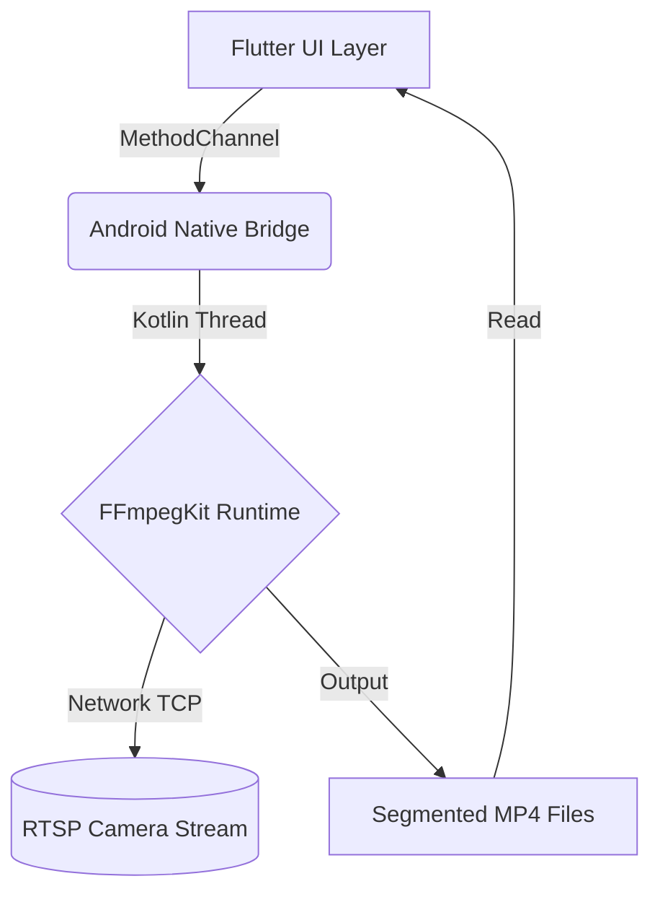

# 📹 CCTV Camera Stream Recorder App

## 📋 Overview
The **CCTV Camera Stream Recorder App** is a robust, production-ready Android application built with **Flutter** and **Native Kotlin**. It connects to IP cameras via **RTSP (Real Time Streaming Protocol)** and continuously records the live stream directly to the device's storage. 

Designed for reliability and performance, it bypasses common cross-platform plugin limitations by utilizing a custom **Native Platform Channel** to execute **FFmpegKit** directly in the Android ecosystem.

---

## ✨ Key Functionalities
* **Live RTSP Recording:** Connects to any standard IP CCTV camera using its RTSP URL.
* **Continuous Segmented Recording:** Automatically chunks recordings into defined segment intervals (e.g., every 60 seconds). This prevents data loss from file corruption and avoids massive, unmanageable video files.
* **Native FFmpeg Execution:** Uses the community-maintained `ffmpeg-kit-lts-16kb` library running natively on Android, ensuring stability, high performance, and compatibility with modern Android devices (Android 15+, 16KB page size).
* **Storage Management:** Automatically stores videos in a dedicated `CCTV_Recordings` folder within the public `Downloads` or external storage directory.
* **In-App Media Management:** View saved recordings, check file sizes, delete old footage, and open the destination folder directly from the app.
* **Resilient Background Processing:** The FFmpeg process runs on a dedicated background thread on the Android side, keeping the Flutter UI smooth and responsive.

---

## 🏗️ Architecture & Pipeline

This project employs a hybrid architecture to achieve native performance with a unified UI:



### 1. UI Layer (Flutter / Dart)
* **File:** `lib/screens/home.dart`
* **Role:** Collects user input (RTSP URL, Segment Duration) and handles the "Start/Stop" state. It displays the list of generated `.mp4` recordings.
* **Bridge:** Calls `FFmpegService.dart`, which invokes the native methods via Flutter's `MethodChannel`.

### 2. Native Bridge (Platform Channels)
* **File:** `lib/services/ffmpeg_service.dart` ↔ `MainActivity.kt`
* **Role:** Safely passes commands between Flutter and the Kotlin host. 

### 3. Execution Layer (Kotlin / FFmpeg)
* **File:** `android/app/src/main/kotlin/.../MainActivity.kt`
* **Role:** Constructs the highly optimized FFmpeg command:
  `-rtsp_transport tcp -i <url> -c:v copy -c:a aac -f segment -segment_time <duration> -reset_timestamps 1 -strftime 1 -y "<outputPathPattern>"`
* **Features:** 
  * Re-encodes audio to `aac` while copying the raw video stream (`-c:v copy`) for zero-latency, CPU-efficient recording.
  * Spawns a background thread to execute `FFmpegKit.execute()`, ensuring the app never freezes.

---

## 🚀 Setup & Installation

### Prerequisites
* Flutter SDK (Version 3.13+)
* Android Studio & Android Toolchain

### Build Instructions
1. **Clone the repository.**
2. **Fetch Dependencies:**
   ```bash
   flutter pub get
   ```
3. **Build the APK:**
   ```bash
   flutter build apk --release
   ```
4. **Install on Device:**
   ```bash
   flutter install --release
   ```

### Runtime Requirements
* **Android Device:** API 24 or higher.
* **Permissions:** Storage permissions must be granted to save video files.
* **Network:** The device must be on the same local network as the RTSP camera (or have internet access if the stream is public).

---

## 📁 Core Project Structure

* `lib/main.dart` - Application entry point.
* `lib/screens/home.dart` - Main dashboard for recording and viewing files.
* `lib/services/ffmpeg_service.dart` - Dart wrapper for the native Android Platform Channels.
* `android/app/src/main/kotlin/com/example/cctv_app/MainActivity.kt` - Native Kotlin code handling the FFmpeg execution.
* `android/app/build.gradle.kts` - Gradle configuration embedding the native `ffmpeg-kit-lts-16kb` dependency.

---

## 💡 Why This Approach? (For Technical Review)
Initially, Flutter apps rely on plugins like `ffmpeg_kit_flutter`. However, those are often abandoned, lack modern Android support (like 16KB page sizes in Android 15), or cause build failures. 

By taking the **Platform Channel route**, we maintain total control over the build process. We directly import the native Android AAR of FFmpegKit (`io.github.jamaismagic.ffmpeg`), resulting in:
1. **Zero build errors** relating to outdated Flutter FFmpeg wrappers.
2. **Complete stability** during continuous long-running recording sessions.
3. **Future-proofing** against Flutter SDK updates that often break heavy C++ plugins.